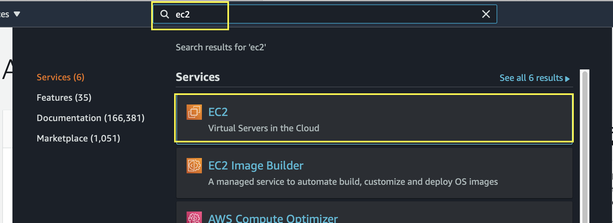
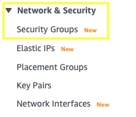
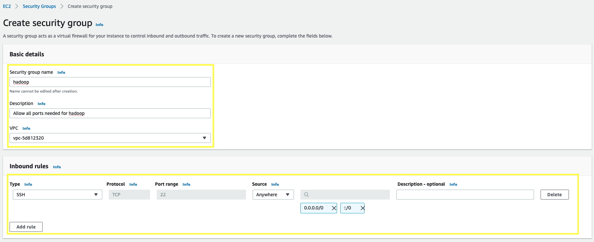

# Creating an EC2 Security Group

1. Go to www.aws.amazon.com and click ***Sign In to the Console***:

2. Once logged in, type ***EC2*** on the search bar and then select the ***EC2*** service from the list:

3. On the right panel of ***EC2 console***, search for ***Network & Security*** under ***Network & Security*** section:

4. On ***Security Groups*** page, click on ***Create security group*** button:

5. On ***Create security group*** page, add the name and description for your group, select the VPC where it should be created and then start adding rules. By default, any outbound port and IP (even outside the boundaries of AWS) are allowed. But for the inbound the rules should be explicitly set. You can use the hints from the menu to configure or, if you are familiar on how this work, you can simply select ***TCP*** as type, the port and add the IP ranges. On our case, we are opening the port 22 (SSH) for requests from Anywhere and we can use the hints from the menus:

    **Notes:**
    * **Outbound** is any requests made FROM the server to outside it. As said, everything call to external IPs (in relation to server IP) are allowed by defaul and any restriction should be explicitly made
    * On the other hand **Inbound** is any call from external IPs (in relation to the server IP). Even though after the call data will flow throught the port FROM the server to the external caller, it is considered **Inbound**. As previously said, nothing is allowed on **Inbound** rules unless explicity permissions are given. 

6. Once you have added all the rules, you can go to the bottom-right of the page and just click on ***Create security group*** button:

